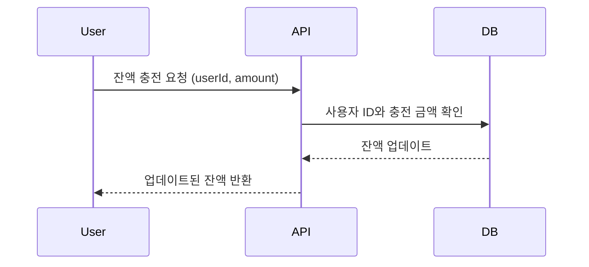
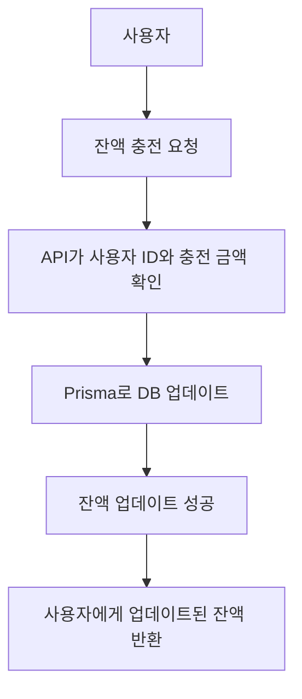
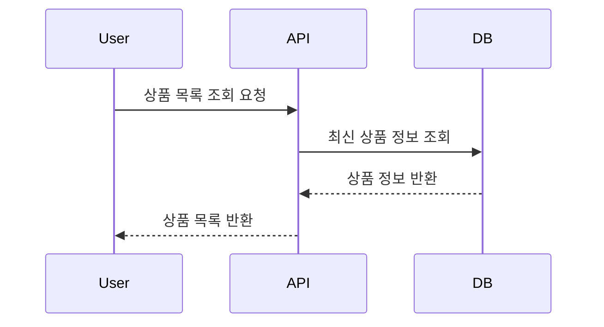
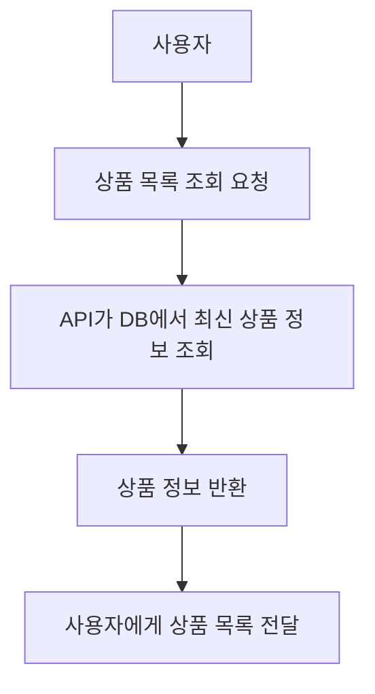
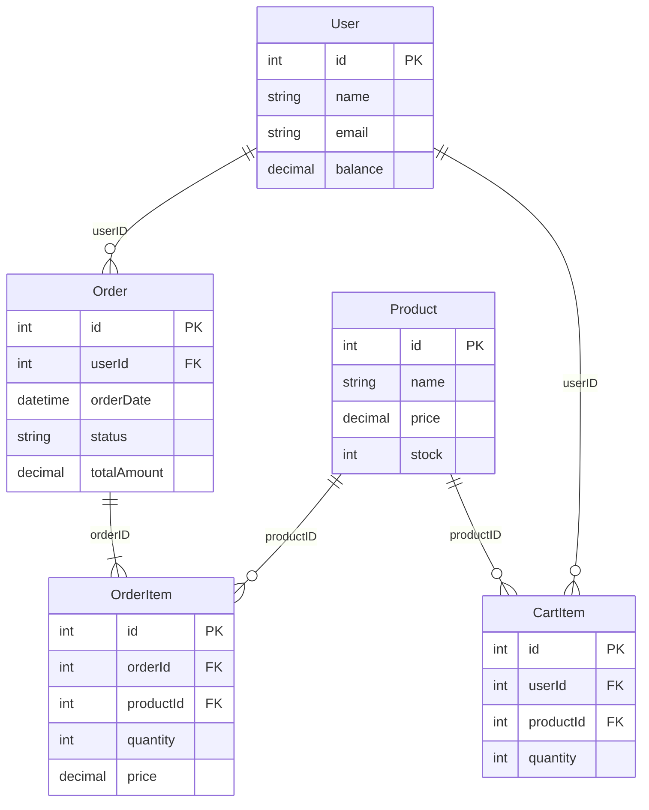

# E-Commerce 상품 주문 서비스

## 목차
1. [프로젝트 개요](#프로젝트-개요)
2. [기술 스택](#기술-스택)
3. [API 명세](#api-명세)
4. [주요 기능 및 시나리오](#주요-기능-및-시나리오)
5. [설치 및 실행 방법](#설치-및-실행-방법)
6. [테스트](#테스트)
7. [ERD](#erd)

## 프로젝트 개요
본 프로젝트는 e-커머스 상품 주문 서비스를 구현한 것입니다. 사용자는 상품을 조회하고, 잔액을 충전하여 주문할 수 있으며, 인기 있는 상품을 추천받을 수 있습니다.

### 주요 기능
- 잔액 충전 및 조회
- 상품 조회
- 주문 및 결제
- 인기 상품 조회
- 장바구니 기능

## 기술 스택
- 언어: TypeScript
- 데이터베이스: mySQL Server
- ORM: Prisma
- 테스트: Jest
- 빌드 도구: npm

## API 명세

### 1. 잔액 충전 / 조회 API

#### 잔액 충전
- **URL**: `/api/balance/charge`
- **Method**: POST
- **Request Body**:
  ```typescript
  {
    userId: number;
    amount: number;
  }
  ```
- **Response**:
  ```typescript
  {
    userId: number;
    balance: number;
  }
  ```

#### 잔액 조회
- **URL**: `/api/balance/:userId`
- **Method**: GET
- **Response**:
  ```typescript
  {
    userId: number;
    balance: number;
  }
  ```

### 2. 상품 조회 API
- **URL**: `/api/products`
- **Method**: GET
- **Response**:
  ```typescript
  Array<{
    id: number;
    name: string;
    price: number;
    stock: number;
  }>
  ```

### 3. 주문 / 결제 API
- **URL**: `/api/orders`
- **Method**: POST
- **Request Body**:
  ```typescript
  {
    userId: number;
    items: Array<{
      productId: number;
      quantity: number;
    }>;
  }
  ```
- **Response**:
  ```typescript
  {
    orderId: number;
    totalAmount: number;
    status: string;
  }
  ```

### 4. 인기 상품 조회 API
- **URL**: `/api/products/popular`
- **Method**: GET
- **Response**:
  ```typescript
  Array<{
    id: number;
    name: string;
    price: number;
    salesCount: number;
  }>
  ```

### 5. 장바구니 API (심화)

#### 상품 추가
- **URL**: `/api/cart/add`
- **Method**: POST
- **Request Body**:
  ```typescript
  {
    userId: number;
    productId: number;
    quantity: number;
  }
  ```

#### 상품 삭제
- **URL**: `/api/cart/remove`
- **Method**: POST
- **Request Body**:
  ```typescript
  {
    userId: number;
    productId: number;
  }
  ```

#### 장바구니 조회
- **URL**: `/api/cart/:userId`
- **Method**: GET
- **Response**:
  ```typescript
  Array<{
    productId: number;
    name: string;
    price: number;
    quantity: number;
  }>
  ```

## 주요 기능 및 시나리오

### 1. 잔액 충전 / 조회

#### 시퀀스 다이어그램


#### 플로우 차트


#### 시나리오 분석
1. 사용자가 잔액 충전 요청을 보냅니다.
2. 시스템은 사용자 ID와 충전 금액을 확인합니다.
3. Prisma ORM을 사용하여 잔액을 업데이트하고 트랜잭션을 커밋합니다.
4. 업데이트된 잔액 정보를 반환합니다.

### 2. 상품 조회

#### 시퀀스 다이어그램


#### 플로우 차트


#### 시나리오 분석
1. 사용자가 상품 목록 조회를 요청합니다.
2. 시스템은 Prisma를 사용하여 데이터베이스에서 최신 상품 정보를 조회합니다.
3. 조회된 상품 정보(ID, 이름, 가격, 재고)를 반환합니다.

### 3. 주문 / 결제

#### 시퀀스 다이어그램
sequenceDiagram
    participant User
    participant API
    participant DB
    User->>API: 주문 요청 (userId, items)
    API->>DB: 재고 확인 및 잔액 확인
    DB-->>API: 재고 및 잔액 충분 여부 반환
    API->>DB: 잔액 차감 및 재고 감소
    DB-->>API: 주문 정보 저장
    API-->>User: 주문 완료 및 결제 결과 반환

#### 플로우 차트
graph TD;
    A[사용자] --> B[주문 요청];
    B --> C[API가 재고 및 잔액 확인];
    C --> D[재고 및 잔액 충분 여부 확인];
    D --> E[재고 감소 및 잔액 차감];
    E --> F[주문 정보 저장];
    F --> G[사용자에게 주문 완료 결과 반환];

#### 시나리오 분석
1. 사용자가 주문 요청을 보냅니다.
2. 시스템은 Prisma를 사용하여 주문 상품의 재고를 확인합니다.
3. 사용자의 잔액을 확인합니다.
4. 재고와 잔액이 충분하면 결제를 진행합니다.
5. Prisma 트랜잭션을 사용하여 재고를 감소시키고 사용자 잔액을 차감합니다.
6. 주문 정보를 데이터베이스에 저장합니다.
7. 주문 정보를 외부 데이터 플랫폼에 전송합니다.
8. 주문 결과를 사용자에게 반환합니다.

### 4. 인기 상품 조회

#### 시퀀스 다이어그램
sequenceDiagram
    participant User
    participant API
    participant DB
    User->>API: 인기 상품 조회 요청
    API->>DB: 최근 3일간의 주문 데이터 조회
    DB-->>API: 상위 5개 인기 상품 반환
    API-->>User: 인기 상품 목록 반환

#### 플로우 차트
graph TD;
    A[사용자] --> B[인기 상품 조회 요청];
    B --> C[API가 최근 주문 데이터 조회];
    C --> D[판매량 상위 5개 상품 반환];
    D --> E[사용자에게 인기 상품 목록 반환];

#### 시나리오 분석
1. 사용자가 인기 상품 조회를 요청합니다.
2. 시스템은 Prisma를 사용하여 최근 3일간의 주문 데이터를 분석합니다.
3. 판매량이 높은 상위 5개 상품을 선별합니다.
4. 선별된 상품 정보를 반환합니다.

### 5. 장바구니 기능 (심화)

#### 시퀀스 다이어그램
sequenceDiagram
    participant User
    participant API
    participant DB
    User->>API: 상품 추가/삭제 요청 (add/remove)
    API->>DB: 장바구니 업데이트
    DB-->>API: 장바구니 상태 반환
    API-->>User: 업데이트된 장바구니 반환

#### 플로우 차트
graph TD;
    A[사용자] --> B[상품 장바구니 추가/삭제 요청];
    B --> C[API가 장바구니 업데이트];
    C --> D[DB에서 장바구니 정보 갱신];
    D --> E[업데이트된 장바구니 정보 반환];
    E --> F[사용자에게 장바구니 상태 전달];

#### 시나리오 분석
1. 사용자가 상품을 장바구니에 추가/삭제 요청을 합니다.
2. 시스템은 Prisma를 사용하여 사용자의 장바구니 정보를 업데이트합니다.
3. 장바구니 조회 시, Prisma를 통해 최신 장바구니 정보를 반환합니다.

## ERD
