# E-Commerce 상품 주문 서비스

## 목차
1. [프로젝트 개요](#프로젝트-개요)
2. [기술 스택](#기술-스택)
3. [API 명세](#api-명세)
4. [주요 기능 및 시나리오](#주요-기능-및-시나리오)
5. [테스트](#테스트-설명)
6. [ERD](#erd)

## 프로젝트 개요
본 프로젝트는 e-커머스 상품 주문 서비스를 구현한 것입니다. 사용자는 상품을 조회하고, 잔액을 충전하여 주문할 수 있으며, 인기 있는 상품을 추천받을 수 있습니다.

### 주요 기능
- 잔액 충전 및 조회
- 상품 조회
- 주문 및 결제
- 인기 상품 조회
- 장바구니 기능

## 기술 스택
- 언어: TypeScript
- 데이터베이스: mySQL Server
- ORM: Prisma
- 테스트: Jest
- 빌드 도구: npm

## API 명세

### 1. 잔액 충전 / 조회 API

#### 잔액 충전
- **URL**: `/api/balance/charge`
- **Method**: POST
- **Request Body**:
  ```typescript
  {
    userId: number;
    amount: number;
  }
  ```
- **Response**:
  ```typescript
  {
    userId: number;
    balance: number;
  }
  ```

#### 잔액 조회
- **URL**: `/api/balance/:userId`
- **Method**: GET
- **Response**:
  ```typescript
  {
    userId: number;
    balance: number;
  }
  ```

### 2. 상품 조회 API
- **URL**: `/api/products`
- **Method**: GET
- **Response**:
  ```typescript
  Array<{
    id: number;
    name: string;
    price: number;
    stock: number;
  }>
  ```

### 3. 주문 / 결제 API
- **URL**: `/api/orders`
- **Method**: POST
- **Request Body**:
  ```typescript
  {
    userId: number;
    items: Array<{
      productId: number;
      quantity: number;
    }>;
  }
  ```
- **Response**:
  ```typescript
  {
    orderId: number;
    totalAmount: number;
    status: string;
  }
  ```

### 4. 인기 상품 조회 API
- **URL**: `/api/products/popular`
- **Method**: GET
- **Response**:
  ```typescript
  Array<{
    id: number;
    name: string;
    price: number;
    salesCount: number;
  }>
  ```

### 5. 장바구니 API (심화)

#### 상품 추가
- **URL**: `/api/cart/add`
- **Method**: POST
- **Request Body**:
  ```typescript
  {
    userId: number;
    productId: number;
    quantity: number;
  }
  ```

#### 상품 삭제
- **URL**: `/api/cart/remove`
- **Method**: POST
- **Request Body**:
  ```typescript
  {
    userId: number;
    productId: number;
  }
  ```

#### 장바구니 조회
- **URL**: `/api/cart/:userId`
- **Method**: GET
- **Response**:
  ```typescript
  Array<{
    productId: number;
    name: string;
    price: number;
    quantity: number;
  }>
  ```

## 주요 기능 및 시나리오

### 1. 잔액 충전 / 조회

#### 시퀀스 다이어그램
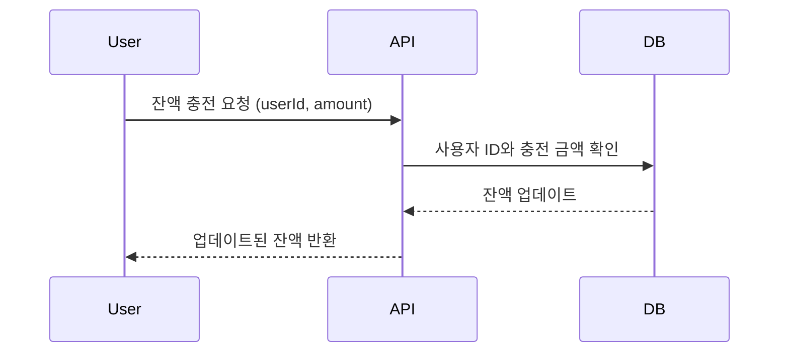

#### 플로우 차트
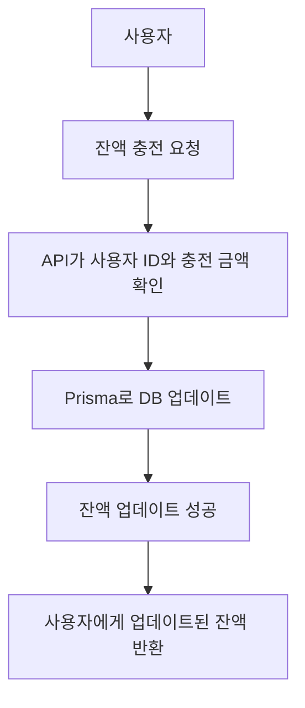

#### 시나리오 분석
1. 사용자가 잔액 충전 요청을 보냅니다.
2. 시스템은 사용자 ID와 충전 금액을 확인합니다.
3. Prisma ORM을 사용하여 잔액을 업데이트하고 트랜잭션을 커밋합니다.
4. 업데이트된 잔액 정보를 반환합니다.

### 2. 상품 조회

#### 시퀀스 다이어그램
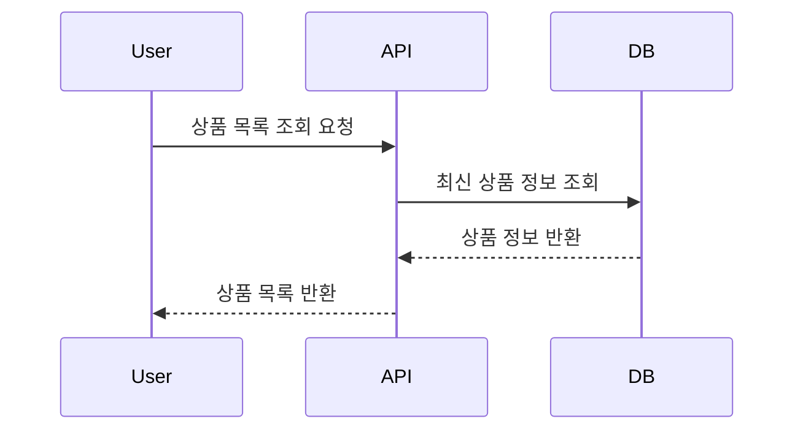

#### 플로우 차트
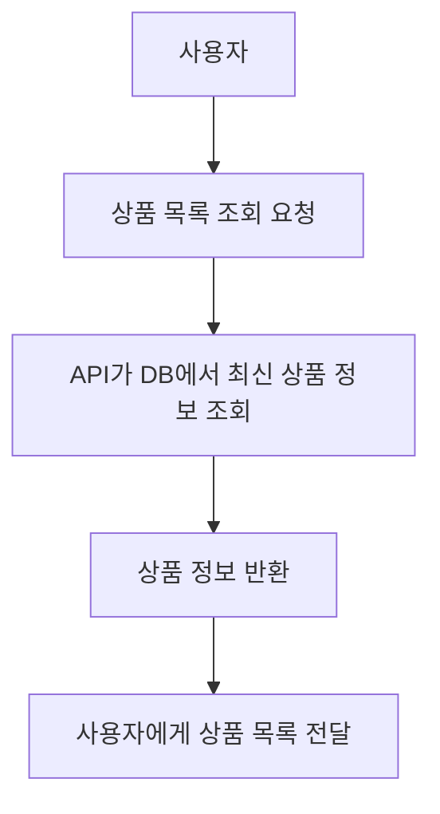

#### 시나리오 분석
1. 사용자가 상품 목록 조회를 요청합니다.
2. 시스템은 Prisma를 사용하여 데이터베이스에서 최신 상품 정보를 조회합니다.
3. 조회된 상품 정보(ID, 이름, 가격, 재고)를 반환합니다.

### 3. 주문 / 결제

#### 시퀀스 다이어그램
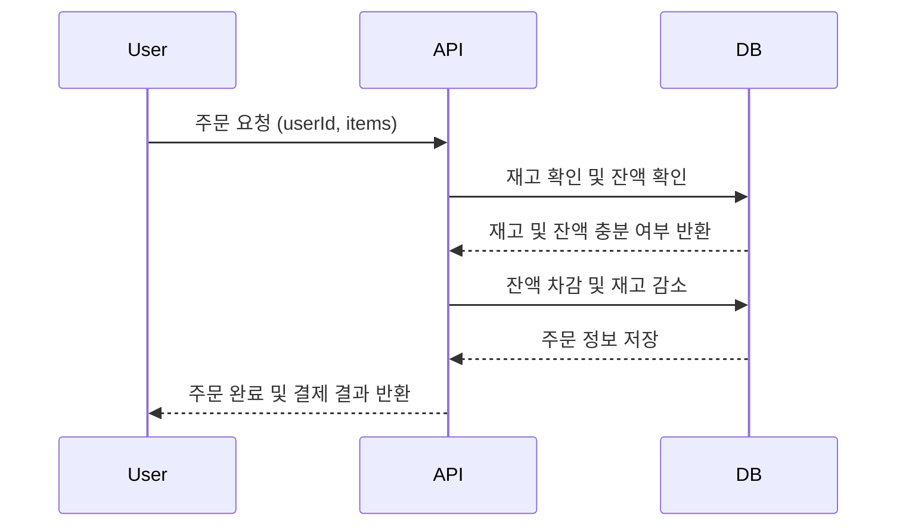

#### 플로우 차트
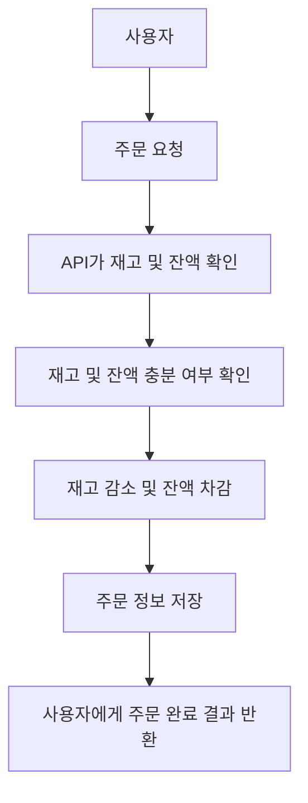

#### 시나리오 분석
1. 사용자가 주문 요청을 보냅니다.
2. 시스템은 Prisma를 사용하여 주문 상품의 재고를 확인합니다.
3. 사용자의 잔액을 확인합니다.
4. 재고와 잔액이 충분하면 결제를 진행합니다.
5. Prisma 트랜잭션을 사용하여 재고를 감소시키고 사용자 잔액을 차감합니다.
6. 주문 정보를 데이터베이스에 저장합니다.
7. 주문 정보를 외부 데이터 플랫폼에 전송합니다.
8. 주문 결과를 사용자에게 반환합니다.

### 4. 인기 상품 조회

#### 시퀀스 다이어그램
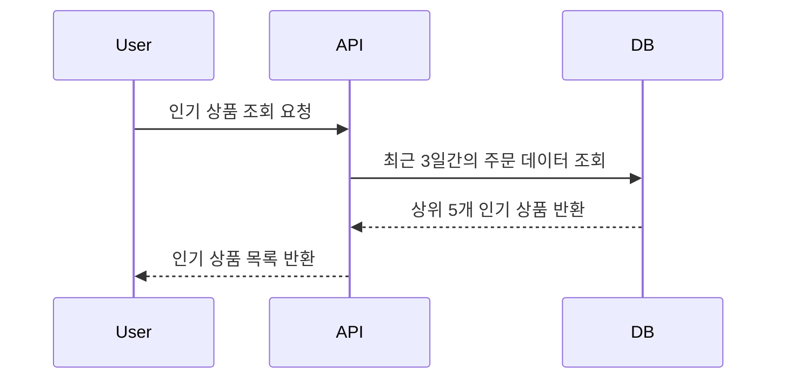

#### 플로우 차트
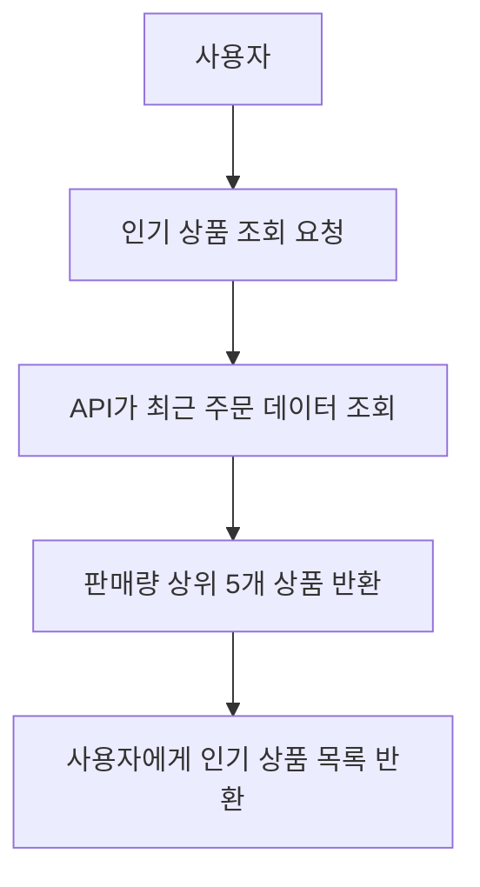

#### 시나리오 분석
1. 사용자가 인기 상품 조회를 요청합니다.
2. 시스템은 Prisma를 사용하여 최근 3일간의 주문 데이터를 분석합니다.
3. 판매량이 높은 상위 5개 상품을 선별합니다.
4. 선별된 상품 정보를 반환합니다.

### 5. 장바구니 기능 (심화)

#### 시퀀스 다이어그램
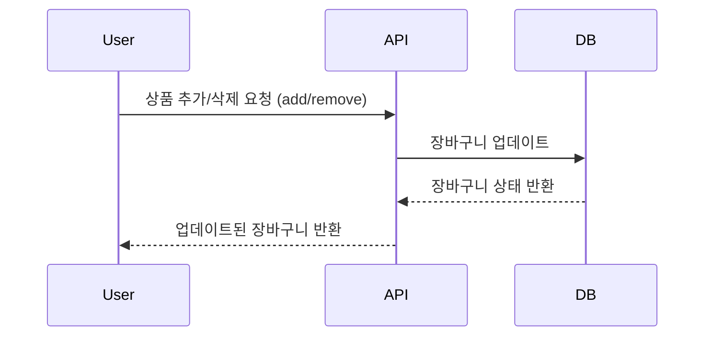

#### 플로우 차트
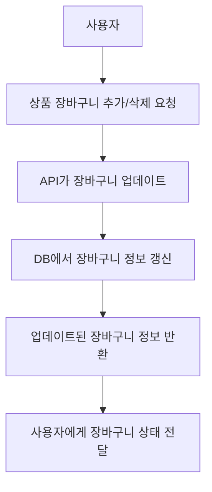

#### 시나리오 분석
1. 사용자가 상품을 장바구니에 추가/삭제 요청을 합니다.
2. 시스템은 Prisma를 사용하여 사용자의 장바구니 정보를 업데이트합니다.
3. 장바구니 조회 시, Prisma를 통해 최신 장바구니 정보를 반환합니다.

## 테스트 설명

### 테스트 위치

src/test 폴더 안에 service 및 e2e 테스트 위치하고 있습니다.

### ProductService 테스트

ProductService의 주요 기능을 테스트합니다.

#### findAll

**목적**: 모든 상품을 정상적으로 조회할 수 있는지 확인합니다.

**테스트 내용**:
- 모의 상품 데이터를 설정합니다.
- findAll 메서드를 호출합니다.
- 반환된 결과가 모의 데이터와 일치하는지 확인합니다.
- PrismaService의 findMany 메서드가 호출되었는지 확인합니다.

#### findById

**목적**: ID로 특정 상품을 정확히 조회할 수 있는지 확인합니다.

**테스트 내용**:
- 모의 상품 데이터를 설정합니다.
- findById 메서드를 특정 ID로 호출합니다.
- 반환된 결과가 모의 데이터와 일치하는지 확인합니다.
- PrismaService의 findUnique 메서드가 올바른 매개변수로 호출되었는지 확인합니다.

#### updateStock

**목적**: 상품의 재고를 정확히 업데이트할 수 있는지 확인합니다.

**테스트 내용**:
- 모의 상품 데이터와 업데이트된 상품 데이터를 설정합니다.
- updateStock 메서드를 호출하여 재고를 변경합니다.
- 반환된 결과가 예상된 업데이트 데이터와 일치하는지 확인합니다.
- PrismaService의 update 메서드가 올바른 매개변수로 호출되었는지 확인합니다.

### UserService 테스트

UserService의 주요 기능을 테스트합니다.

#### findById

**목적**: ID로 사용자를 정확히 조회할 수 있는지 확인합니다.

**테스트 내용**:
- 모의 사용자 데이터를 설정합니다.
- findById 메서드를 호출합니다.
- 반환된 결과가 모의 데이터와 일치하는지 확인합니다.
- 존재하지 않는 사용자 ID로 조회 시 NotFoundException이 발생하는지 확인합니다.

#### chargeBalance

**목적**: 사용자 잔액을 정확히 충전할 수 있는지 확인합니다.

**테스트 내용**:
- 모의 사용자 데이터를 설정합니다.
- chargeBalance 메서드를 호출하여 잔액을 충전합니다.
- 충전 후 잔액이 정확히 업데이트되었는지 확인합니다.
- 음수나 0원 충전 시 BadRequestException이 발생하는지 확인합니다.
- 존재하지 않는 사용자에 대해 충전 시도 시 NotFoundException이 발생하는지 확인합니다.

#### checkBalance

**목적**: 사용자의 잔액이 충분한지 정확히 확인할 수 있는지 테스트합니다.

**테스트 내용**:
- 모의 사용자 데이터를 설정합니다.
- checkBalance 메서드를 호출하여 잔액 충분 여부를 확인합니다.
- 잔액이 충분할 때 true를 반환하는지 확인합니다.
- 잔액이 부족할 때 false를 반환하는지 확인합니다.
- 존재하지 않는 사용자에 대해 확인 시도 시 NotFoundException이 발생하는지 확인합니다.

### OrderService 테스트

OrderService의 주요 기능을 테스트합니다.

#### create

**목적**: 주문을 정확히 생성할 수 있는지 확인합니다.

**테스트 내용**:
- 모의 주문 데이터, 사용자 데이터, 상품 데이터를 설정합니다.
- create 메서드를 호출하여 주문을 생성합니다.
- 생성된 주문이 예상 데이터와 일치하는지 확인합니다.
- 사용자 잔액이 부족할 때 BadRequestException이 발생하는지 확인합니다.
- 존재하지 않는 사용자로 주문 시도 시 NotFoundException이 발생하는지 확인합니다.

## ERD
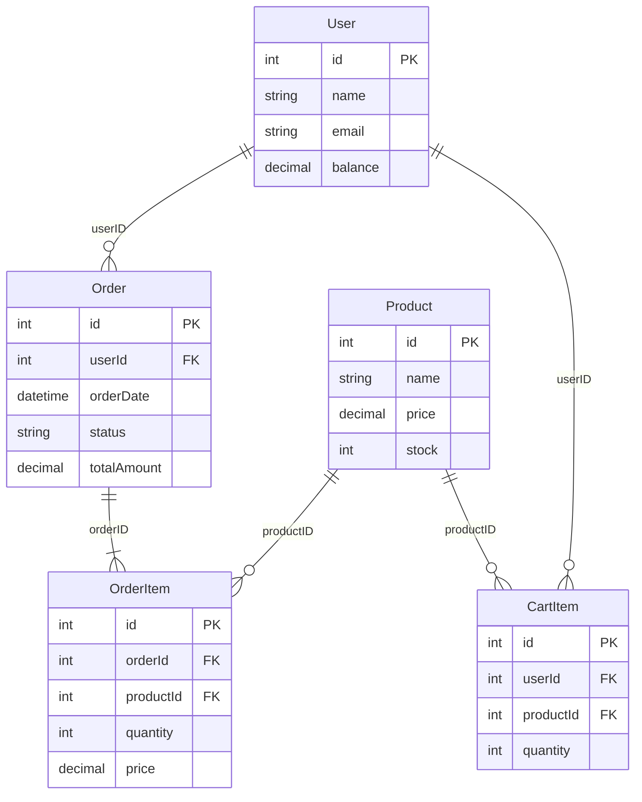